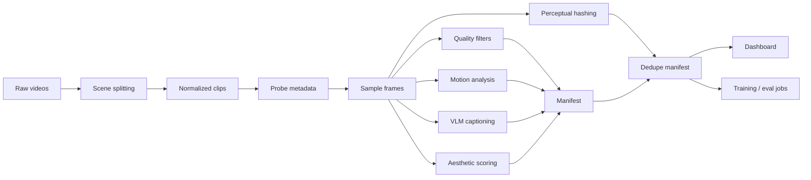

# Video Dataset Factory

A research-oriented pipeline for turning raw videos into training-ready, captioned, filtered datasets for text-to-video and image/video generative model experiments.

This project is designed as a portfolio-grade ML Engineer (Research) project for video generative AI roles. It focuses on the parts that matter in real R&D work: data quality, reproducibility, evaluation, throughput, and clear experiment reporting.

## Research Goal & Current Results

**Goal:** build a reproducible video data pipeline that ingests raw clips, splits or normalizes them, extracts quality and motion signals, generates real VLM captions from sampled frames, filters bad samples, removes near-duplicates, and exports a training-ready manifest.

Current status:

| Area | Status |
| --- | --- |
| Project skeleton | Done |
| Scene splitting + ffmpeg normalization | Done |
| Clip metadata schema | Done |
| Quality filters | Done |
| Motion feature extraction | Done |
| Captioning interface + cache | Done |
| Qwen/LLaVA dense-caption prompt adapter | Done |
| Batched caption generation interface | Done |
| Groq/OpenAI-compatible VLM captioning backend | Done |
| CLIP-style aesthetic scoring adapter | Done |
| Perceptual duplicate detection | Done |
| Manifest summary reporting | Done |
| JSONL manifest writer | Done |
| CLI pipeline | Done |
| Single-process/Ray throughput benchmark | Done |
| Ray execution adapter | Done |
| Streamlit upload/review dashboard | Done |
| Streamlit Cloud deployment config | Done |
| Inference optimization benchmark | Done |
| Transformers VLM backend | Experimental |

Demo fixture results from `examples/demo_manifest.jsonl`:

| Metric | Value |
| --- | ---: |
| Total clips | 6 |
| Accepted clips | 3 |
| Rejected clips | 3 |
| Acceptance rate | 50.0% |
| Near-duplicate clips | 1 |
| Average aesthetic score | 6.95 |
| Average motion score | 2.36 |

These are synthetic smoke-test artifacts, not benchmark claims. For a real application, replace them with results from your own clips and keep the generated report in `examples/` or a release artifact.

Target headline once experiments are complete:

> Processed 1,000 clips with a Ray-based pipeline, rejected low-quality samples with auditable reasons, generated frame-grounded VLM captions, and benchmarked inference optimizations on speed and peak VRAM.

## Portfolio Docs

- [Role alignment](docs/HIGGSFIELD_ALIGNMENT.md): how this project maps to video generative AI research engineering work.
- [Experiment runbook](docs/RUNBOOK.md): end-to-end commands for producing a real dataset report.
- [Streamlit deployment](docs/STREAMLIT_DEPLOY.md): public app deployment settings and limits.
- [Experiment log](docs/EXPERIMENT_LOG.md): hypotheses, risks, and failed-experiment tracking.
- [Demo dataset summary](examples/demo_summary.md): synthetic fixture report format.
- [Inference dry-run report](examples/inference_dry_run_report.md): CI-friendly latency/VRAM trade-off example.

## Why This Matters

Video generation models are only as strong as their data and evaluation loops. This repo demonstrates the engineering work behind research: converting messy raw video into reliable, searchable, measurable training examples.

The pipeline is intentionally modular:



## Features

- PySceneDetect scene splitting for raw long videos.
- ffmpeg normalization to fixed FPS and resolution.
- Video metadata probing via OpenCV.
- Frame sampling for lightweight inspection.
- Blur, brightness, resolution, duration, text-area, motion, and aesthetic quality gates.
- Optical-flow motion statistics.
- Captioning interface with JSON cache, keyframe selection, Qwen2-VL/LLaVA prompt formatting, batched caption generation, Groq/OpenAI-compatible hosted VLM calls, and optional local Transformers VLM backend.
- Aesthetic scoring via CPU heuristic or optional CLIP preference proxy.
- Perceptual hashes and manifest-level near-duplicate rejection.
- Markdown dataset summary reports for portfolio-ready experiment writeups.
- Streamlit dashboard with small upload processing, manifest upload for large runs, filters, score charts, clip review, and JSONL/CSV/Markdown exports.
- CLI commands for splitting scenes, processing one clip, processing a folder, deduplicating manifests, summarizing manifests, benchmarking preprocessing throughput, and benchmarking inference settings.
- Ray adapter and benchmark mode for comparing distributed preprocessing throughput.
- Inference benchmark harness for latency/VRAM trade-offs across steps, slicing, dtype, and compile settings.

## Quickstart

```bash
python -m venv .venv
source .venv/bin/activate  # Windows: .venv\\Scripts\\activate
pip install -e .[dev,scene,dashboard]
```

You also need `ffmpeg` available on PATH for scene export.

Split a raw video into normalized scene clips:

```bash
vdf split-scenes data/raw/example.mp4 --output-dir data/clips
```

Process one video:

```bash
vdf process-video path/to/video.mp4 --output outputs/manifest.jsonl
```

Process a folder:

```bash
vdf process-folder data/clips --output outputs/manifest.jsonl
```

Remove near-duplicates from a manifest:

```bash
vdf dedupe-manifest outputs/manifest.jsonl --output outputs/manifest_deduped.jsonl --threshold 6
```

Generate a markdown dataset summary:

```bash
vdf summarize-manifest outputs/manifest_deduped.jsonl --output outputs/dataset_summary.md
```

Open the dataset review dashboard:

```bash
streamlit run dashboards/app.py
```

Deploy on Streamlit Community Cloud:

| Field | Value |
| --- | --- |
| Repository | `karatarassul4-max/video-dataset-factory` |
| Branch | `main` |
| Main file path | `dashboards/app.py` |

The public upload path uses real Groq VLM captioning. Add `GROQ_API_KEY` in Streamlit app secrets before using `upload videos`; optionally add `GROQ_MODEL` to override the default `meta-llama/llama-4-scout-17b-16e-instruct` model. The app sends sampled keyframes, not the full video file, to the vision model.

The public app can process up to 10 short uploaded videos in a temporary session. For 50+ clips, run the CLI locally or on a worker, then upload the generated `manifest.jsonl` in the app's `upload manifest JSONL` mode. See [docs/STREAMLIT_DEPLOY.md](docs/STREAMLIT_DEPLOY.md) for details.

Benchmark preprocessing throughput:

```bash
vdf benchmark-folder data/clips --output outputs/pipeline_benchmark.json
vdf benchmark-folder data/clips --ray --output outputs/pipeline_benchmark_ray.json
```

Benchmark inference trade-offs without heavyweight model execution:

```bash
vdf benchmark-inference --dry-run
```

Run a real CUDA diffusers benchmark:

```bash
pip install -e .[inference]
vdf benchmark-inference --real --model runwayml/stable-diffusion-v1-5
```

Run with the Groq hosted VLM backend:

```yaml
captioning:
  provider: groq
  api_key: ${GROQ_API_KEY}
  model_name: meta-llama/llama-4-scout-17b-16e-instruct
  max_keyframes: 4
  max_new_tokens: 180
  cache_path: outputs/caption_cache.json
```

Groq vision uses the OpenAI-compatible Chat Completions endpoint and supports up to 5 images per request for the selected model. See the Groq vision docs: https://console.groq.com/docs/vision

Run with an optional local Hugging Face VLM backend by changing `configs/default.yaml`:

```yaml
captioning:
  provider: transformers
  model_name: Qwen/Qwen2-VL-2B-Instruct
  model_family: qwen2-vl
  max_keyframes: 4
  max_new_tokens: 160
  cache_path: outputs/caption_cache.json
```

For LLaVA-style models, set `model_family: llava`. If a real VLM provider is selected without its required key or model name, the pipeline raises an error instead of emitting fake captions.

Enable aesthetic filtering with the fast heuristic scorer:

```yaml
aesthetic:
  provider: heuristic
quality:
  min_aesthetic_score: 5.0
```

Enable the optional CLIP preference proxy:

```bash
pip install -e .[aesthetic]
```

```yaml
aesthetic:
  provider: clip
  model_name: openai/clip-vit-base-patch32
  max_frames: 4
```

Run tests:

```bash
pytest
```

## Manifest Schema

Each output row contains:

- `clip_id`
- `source_path`
- `duration_sec`
- `fps`
- `width`
- `height`
- `frame_count`
- `blur_score`
- `brightness_score`
- `motion_score`
- `ocr_text_area_ratio`
- `aesthetic_score`
- `perceptual_hash`
- `duplicate_of`
- `caption`
- `motion_caption`
- `keep`
- `reject_reasons`

## Evaluation Plan

The project will report:

- dataset yield: accepted vs rejected clips;
- reject precision: manual inspection of rejected samples;
- caption usefulness: small manual rubric over 30 clips;
- duplicate rate: near-duplicate groups found by pHash threshold;
- throughput: clips per minute, single process vs Ray;
- cost estimate: CPU/GPU minutes per 1,000 clips;
- inference benchmark: latency, peak VRAM, and quality proxy for selected model settings.

## Failed Experiments Log

This section is intentionally part of the project. Research engineering is not just final numbers; it is also explaining why certain filters, prompts, thresholds, or optimizations failed.

Planned entries:

- Scene threshold too low over-splits videos with camera shake.
- OCR threshold too strict and rejects useful videos with small signs.
- Motion threshold too high and removes slow cinematic shots.
- Generic VLM prompts produce object lists but miss temporal dynamics.
- Ray overhead can dominate throughput on tiny clip folders.
- Aggressive inference optimization trades smoothness for speed.
- CLIP aesthetic prompts can prefer glossy images over dataset diversity.
- pHash threshold above 8 starts grouping visually different clips with similar composition.

## Roadmap

- Replace CLIP preference proxy with LAION aesthetic linear head.
- Run the pipeline on 50-100 real Creative Commons clips and commit the result report.

## License

MIT
