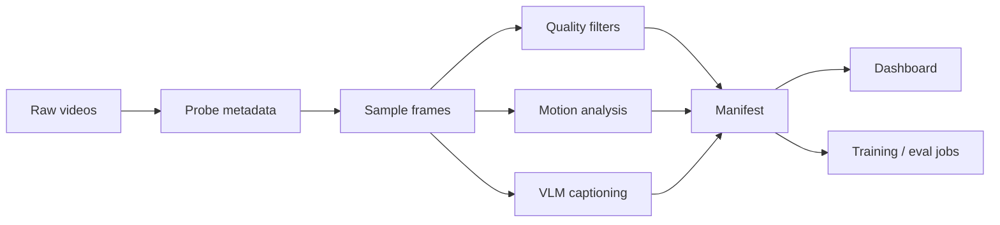

# Video Dataset Factory

A research-oriented pipeline for turning raw videos into training-ready, captioned, filtered datasets for text-to-video and image/video generative model experiments.

This project is designed as a portfolio-grade ML Engineer (Research) project for video generative AI roles. It focuses on the parts that matter in real R&D work: data quality, reproducibility, evaluation, throughput, and clear experiment reporting.

## Research Goal & Current Results

**Goal:** build a reproducible video data pipeline that ingests raw clips, splits or normalizes them, extracts quality and motion signals, generates captions, filters bad samples, and exports a training-ready manifest.

Current status:

| Area | Status |
| --- | --- |
| Project skeleton | Done |
| Clip metadata schema | Done |
| Quality filters | Done |
| Motion feature extraction | Done |
| JSONL manifest writer | Done |
| CLI pipeline | Done |
| Ray execution adapter | Stubbed |
| VLM captioning adapter | Stubbed |
| Inference optimization benchmark | Stubbed |
| Dashboard | Stubbed |

Target headline once experiments are complete:

> Processed 1,000 clips with a Ray-based pipeline, rejected low-quality samples with auditable reasons, improved caption usefulness through prompt iteration, and benchmarked inference optimizations on speed and peak VRAM.

## Why This Matters

Video generation models are only as strong as their data and evaluation loops. This repo demonstrates the engineering work behind research: converting messy raw video into reliable, searchable, measurable training examples.

The pipeline is intentionally modular:



## Features

- Video metadata probing via OpenCV.
- Frame sampling for lightweight inspection.
- Blur, brightness, resolution, duration, and text-area quality gates.
- Optical-flow motion statistics.
- JSONL manifest export with keep/reject reasons.
- CLI commands for processing one clip or a folder.
- Optional Ray adapter for parallel execution.
- Clean extension points for VLM captioning and inference benchmarking.

## Quickstart

```bash
python -m venv .venv
source .venv/bin/activate  # Windows: .venv\\Scripts\\activate
pip install -e .[dev]
```

Process one video:

```bash
vdf process-video path/to/video.mp4 --output outputs/manifest.jsonl
```

Process a folder:

```bash
vdf process-folder data/raw --output outputs/manifest.jsonl
```

Run tests:

```bash
pytest
```

## Manifest Schema

Each output row contains:

- `clip_id`
- `source_path`
- `duration_sec`
- `fps`
- `width`
- `height`
- `frame_count`
- `blur_score`
- `brightness_score`
- `motion_score`
- `ocr_text_area_ratio`
- `aesthetic_score`
- `caption`
- `motion_caption`
- `keep`
- `reject_reasons`

## Evaluation Plan

The project will report:

- dataset yield: accepted vs rejected clips;
- reject precision: manual inspection of rejected samples;
- caption usefulness: small manual rubric over 30 clips;
- throughput: clips per minute, single process vs Ray;
- cost estimate: CPU/GPU minutes per 1,000 clips;
- inference benchmark: latency, peak VRAM, and quality proxy for selected model settings.

## Failed Experiments Log

This section is intentionally part of the project. Research engineering is not just final numbers; it is also explaining why certain filters, prompts, thresholds, or optimizations failed.

Planned entries:

- OCR threshold too strict and rejects useful videos with small signs.
- Motion threshold too high and removes slow cinematic shots.
- Aggressive inference optimization trades smoothness for speed.

## Roadmap

- Add PySceneDetect-based scene splitting.
- Add ffmpeg clip normalization helper.
- Add Qwen2-VL / LLaVA caption adapter.
- Add CLIP aesthetic scoring adapter.
- Add Ray distributed processing implementation.
- Add Streamlit dashboard.
- Add inference optimization benchmark for a small diffusion/video model.

## License

MIT
