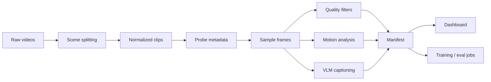

# Video Dataset Factory

A research-oriented pipeline for turning raw videos into training-ready, captioned, filtered datasets for text-to-video and image/video generative model experiments.

This project is designed as a portfolio-grade ML Engineer (Research) project for video generative AI roles. It focuses on the parts that matter in real R&D work: data quality, reproducibility, evaluation, throughput, and clear experiment reporting.

## Research Goal & Current Results

**Goal:** build a reproducible video data pipeline that ingests raw clips, splits or normalizes them, extracts quality and motion signals, generates captions, filters bad samples, and exports a training-ready manifest.

Current status:

| Area | Status |
| --- | --- |
| Project skeleton | Done |
| Scene splitting + ffmpeg normalization | Done |
| Clip metadata schema | Done |
| Quality filters | Done |
| Motion feature extraction | Done |
| Captioning interface + cache | Done |
| JSONL manifest writer | Done |
| CLI pipeline | Done |
| Single-process/Ray throughput benchmark | Done |
| Ray execution adapter | Done |
| Dataset review dashboard | Done |
| Inference optimization benchmark | Done |
| Transformers VLM backend | Experimental |

Target headline once experiments are complete:

> Processed 1,000 clips with a Ray-based pipeline, rejected low-quality samples with auditable reasons, improved caption usefulness through prompt iteration, and benchmarked inference optimizations on speed and peak VRAM.

## Why This Matters

Video generation models are only as strong as their data and evaluation loops. This repo demonstrates the engineering work behind research: converting messy raw video into reliable, searchable, measurable training examples.

The pipeline is intentionally modular:



## Features

- PySceneDetect scene splitting for raw long videos.
- ffmpeg normalization to fixed FPS and resolution.
- Video metadata probing via OpenCV.
- Frame sampling for lightweight inspection.
- Blur, brightness, resolution, duration, and text-area quality gates.
- Optical-flow motion statistics.
- Captioning interface with heuristic fallback, JSON cache, and optional Transformers VLM backend.
- JSONL manifest export with keep/reject reasons.
- Streamlit review dashboard with filters, score charts, reject reason charts, clip preview, and CSV export.
- CLI commands for splitting scenes, processing one clip, processing a folder, benchmarking preprocessing throughput, and benchmarking inference settings.
- Ray adapter and benchmark mode for comparing distributed preprocessing throughput.
- Inference benchmark harness for latency/VRAM trade-offs across steps, slicing, dtype, and compile settings.

## Quickstart

```bash
python -m venv .venv
source .venv/bin/activate  # Windows: .venv\\Scripts\\activate
pip install -e .[dev,scene,dashboard]
```

You also need `ffmpeg` available on PATH for scene export.

Split a raw video into normalized scene clips:

```bash
vdf split-scenes data/raw/example.mp4 --output-dir data/clips
```

Process one video:

```bash
vdf process-video path/to/video.mp4 --output outputs/manifest.jsonl
```

Process a folder:

```bash
vdf process-folder data/clips --output outputs/manifest.jsonl
```

Open the dataset review dashboard:

```bash
streamlit run dashboards/app.py
```

Benchmark preprocessing throughput:

```bash
vdf benchmark-folder data/clips --output outputs/pipeline_benchmark.json
vdf benchmark-folder data/clips --ray --output outputs/pipeline_benchmark_ray.json
```

Benchmark inference trade-offs without heavyweight model execution:

```bash
vdf benchmark-inference --dry-run
```

Run a real CUDA diffusers benchmark:

```bash
pip install -e .[inference]
vdf benchmark-inference --real --model runwayml/stable-diffusion-v1-5
```

Run with an optional Hugging Face VLM backend by changing `configs/default.yaml`:

```yaml
captioning:
  provider: transformers
  model_name: your-vlm-model
  cache_path: outputs/caption_cache.json
```

Run tests:

```bash
pytest
```

## Manifest Schema

Each output row contains:

- `clip_id`
- `source_path`
- `duration_sec`
- `fps`
- `width`
- `height`
- `frame_count`
- `blur_score`
- `brightness_score`
- `motion_score`
- `ocr_text_area_ratio`
- `aesthetic_score`
- `caption`
- `motion_caption`
- `keep`
- `reject_reasons`

## Evaluation Plan

The project will report:

- dataset yield: accepted vs rejected clips;
- reject precision: manual inspection of rejected samples;
- caption usefulness: small manual rubric over 30 clips;
- throughput: clips per minute, single process vs Ray;
- cost estimate: CPU/GPU minutes per 1,000 clips;
- inference benchmark: latency, peak VRAM, and quality proxy for selected model settings.

## Failed Experiments Log

This section is intentionally part of the project. Research engineering is not just final numbers; it is also explaining why certain filters, prompts, thresholds, or optimizations failed.

Planned entries:

- Scene threshold too low over-splits videos with camera shake.
- OCR threshold too strict and rejects useful videos with small signs.
- Motion threshold too high and removes slow cinematic shots.
- Generic VLM prompts produce object lists but miss temporal dynamics.
- Ray overhead can dominate throughput on tiny clip folders.
- Aggressive inference optimization trades smoothness for speed.

## Roadmap

- Add model-specific Qwen2-VL / LLaVA chat-template adapters.
- Add CLIP aesthetic scoring adapter.

## License

MIT
