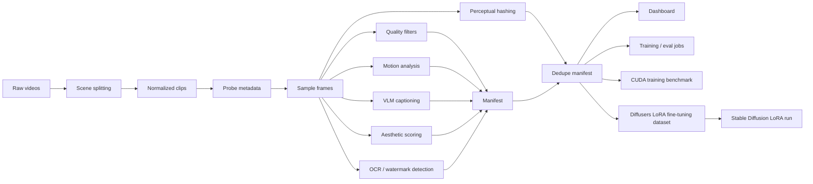

# Video Dataset Factory

A research-oriented pipeline for turning raw videos into training-ready, captioned, filtered datasets for text-to-video and image/video generative model experiments.

This project is designed as a portfolio-grade ML Engineer (Research) project for video generative AI roles. It focuses on the parts that matter in real R&D work: data quality, reproducibility, evaluation, throughput, GPU training mechanics, diffusion fine-tuning, and clear experiment reporting.

## Research Goal & Current Results

**Goal:** build a reproducible video data pipeline that ingests raw clips, splits or normalizes them, extracts quality and motion signals, generates real VLM captions from sampled frames, filters bad samples, removes near-duplicates, exports a training-ready manifest, prepares a Diffusers LoRA fine-tuning dataset, and benchmarks the training/inference systems around that manifest.

Current status:

| Area | Status |
| --- | --- |
| Project skeleton | Done |
| Scene splitting + ffmpeg normalization | Done |
| Clip metadata schema | Done |
| Quality filters | Done |
| Motion feature extraction | Done |
| Captioning interface + cache | Done |
| Qwen/LLaVA dense-caption prompt adapter | Done |
| Batched caption generation interface | Done |
| Groq/OpenAI-compatible VLM captioning backend | Done |
| EasyOCR/Tesseract text and watermark filtering | Done |
| LAION-style aesthetic linear-head adapter | Done |
| CLIP-style aesthetic scoring adapter | Done |
| Perceptual duplicate detection | Done |
| Manifest summary reporting | Done |
| JSONL manifest writer | Done |
| CLI pipeline | Done |
| Diffusers LoRA dataset export | Done |
| Stable Diffusion LoRA fine-tuning runbook | Done |
| Single-process/Ray throughput benchmark | Done |
| Ray execution adapter | Done |
| Streamlit upload/review dashboard | Done |
| Streamlit Cloud deployment config | Done |
| Inference optimization benchmark | Done |
| PyTorch GPU training benchmark | Done |
| Accelerate/DDP launch config | Done |
| DeepSpeed ZeRO-2 launch config | Done |
| Kaggle T4x2 GPU benchmark run | Done |
| Transformers VLM backend | Experimental |

Demo fixture results from `examples/demo_manifest.jsonl`:

| Metric | Value |
| --- | ---: |
| Total clips | 6 |
| Accepted clips | 3 |
| Rejected clips | 3 |
| Acceptance rate | 50.0% |
| Near-duplicate clips | 1 |
| Average aesthetic score | 6.95 |
| Average motion score | 2.36 |

These are synthetic smoke-test artifacts, not benchmark claims. For a real application, replace them with results from your own clips and keep the generated report in `examples/` or a release artifact.

GPU training benchmark results from `examples/kaggle_training_results.md`:

| Run | Distributed type | GPU count | Samples/sec | Peak VRAM MB |
| --- | --- | ---: | ---: | ---: |
| Single-process CUDA | DistributedType.NO | 2 | 3106.05 | 27.64 |
| Accelerate multi-GPU | DistributedType.MULTI_GPU | 2 | 8461.54 | 29.75 |
| DeepSpeed ZeRO-2 | DistributedType.DEEPSPEED | 2 | 5796.43 | 977.60 |

Target headline for a full dataset run:

> Processed 1,000 clips with a Ray-based pipeline, rejected low-quality samples with auditable reasons, generated frame-grounded VLM captions, exported a Diffusers LoRA fine-tuning dataset, and benchmarked CUDA training plus inference optimizations on throughput and peak VRAM.

## Portfolio Docs

- [Role alignment](docs/ROLE_ALIGNMENT.md): how this project maps to video generative AI research engineering work.
- [Experiment runbook](docs/RUNBOOK.md): end-to-end commands for producing a real dataset report.
- [Diffusion LoRA fine-tuning](docs/DIFFUSION_LORA_FINETUNE.md): manifest-to-Diffusers dataset export and Stable Diffusion LoRA workflow.
- [Kaggle GPU training](docs/KAGGLE_GPU_TRAINING.md): CUDA, Accelerate, and optional DeepSpeed benchmark workflow.
- [Kaggle T4x2 training results](examples/kaggle_training_results.md): measured two-GPU training benchmark results.
- [Streamlit deployment](docs/STREAMLIT_DEPLOY.md): public app deployment settings and limits.
- [Experiment log](docs/EXPERIMENT_LOG.md): hypotheses, risks, and failed-experiment tracking.
- [Demo dataset summary](examples/demo_summary.md): synthetic fixture report format.
- [Inference dry-run report](examples/inference_dry_run_report.md): CI-friendly latency/VRAM trade-off example.

## Why This Matters

Video generation models are only as strong as their data and evaluation loops. This repo demonstrates the engineering work behind research: converting messy raw video into reliable, searchable, measurable training examples, then benchmarking and fine-tuning the systems that would consume them.

The pipeline is intentionally modular:



## Features

- PySceneDetect scene splitting for raw long videos.
- ffmpeg normalization to fixed FPS and resolution.
- Video metadata probing via OpenCV.
- Frame sampling for lightweight inspection.
- Blur, brightness, resolution, duration, text-area, motion, and aesthetic quality gates.
- Optical-flow motion statistics.
- Text/watermark filtering through a fast proxy, EasyOCR, or Tesseract.
- Captioning interface with JSON cache, keyframe selection, Qwen2-VL/LLaVA prompt formatting, batched caption generation, Groq/OpenAI-compatible hosted VLM calls, and optional local Transformers VLM backend.
- Aesthetic scoring via CPU heuristic, optional CLIP preference proxy, or LAION-style linear head over open_clip image embeddings.
- Perceptual hashes and manifest-level near-duplicate rejection.
- Markdown dataset summary reports for portfolio-ready experiment writeups.
- Diffusers image-caption dataset export for Stable Diffusion LoRA fine-tuning.
- Kaggle-ready LoRA fine-tuning runbook using the official Hugging Face Diffusers training script.
- Streamlit dashboard with small upload processing, manifest upload for large runs, filters, score charts, clip review, and JSONL/CSV/Markdown exports.
- CLI commands for splitting scenes, processing one clip, processing a folder, deduplicating manifests, summarizing manifests, preparing Diffusers LoRA data, benchmarking preprocessing throughput, benchmarking training, and benchmarking inference settings.
- Ray adapter and benchmark mode for comparing distributed preprocessing throughput.
- PyTorch manifest-caption contrastive training benchmark with CUDA throughput and peak VRAM reporting.
- Hugging Face Accelerate config for single-node multi-GPU launch, plus optional DeepSpeed ZeRO-2 config.
- Inference benchmark harness for latency/VRAM trade-offs across steps, slicing, dtype, and compile settings.

## Quickstart

```bash
python -m venv .venv
source .venv/bin/activate  # Windows: .venv\\Scripts\\activate
pip install -e .[dev,scene,dashboard,ocr,aesthetic]
```

You also need `ffmpeg` available on PATH for scene export. The default config runs real EasyOCR text/watermark filtering and LAION-style aesthetic scoring, so the first run downloads OCR, CLIP, and LAION linear-head weights into local caches.

Split a raw video into normalized scene clips:

```bash
vdf split-scenes data/raw/example.mp4 --output-dir data/clips
```

Process one video:

```bash
vdf process-video path/to/video.mp4 --output outputs/manifest.jsonl
```

Process a folder:

```bash
vdf process-folder data/clips --output outputs/manifest.jsonl
```

Remove near-duplicates from a manifest:

```bash
vdf dedupe-manifest outputs/manifest.jsonl --output outputs/manifest_deduped.jsonl --threshold 6
```

Generate a markdown dataset summary:

```bash
vdf summarize-manifest outputs/manifest_deduped.jsonl --output outputs/dataset_summary.md
```

Prepare a Stable Diffusion LoRA fine-tuning dataset:

```bash
pip install -e .[diffusion-finetune]
vdf prepare-diffusion-lora-data outputs/manifest_deduped.jsonl \
  --output-dir outputs/diffusion_lora_dataset \
  --frames-per-clip 1 \
  --max-clips 100
```

This exports `outputs/diffusion_lora_dataset/metadata.jsonl` plus sampled training images. See [docs/DIFFUSION_LORA_FINETUNE.md](docs/DIFFUSION_LORA_FINETUNE.md) for the official Diffusers training command.

Open the dataset review dashboard:

```bash
streamlit run dashboards/app.py
```

Deploy on Streamlit Community Cloud:

| Field | Value |
| --- | --- |
| Repository | `karatarassul4-max/video-dataset-factory` |
| Branch | `main` |
| Main file path | `dashboards/app.py` |

The public upload path uses real Groq VLM captioning, EasyOCR text/watermark filtering, and LAION-style aesthetic scoring. Add `GROQ_API_KEY` in Streamlit app secrets before using `upload videos`; optionally add `GROQ_MODEL` to override the default `qwen/qwen3.6-27b` model. The app sends sampled keyframes, not the full video file, to the vision model.

The public app can process up to 10 short uploaded videos in a temporary session. For 50+ clips, run the CLI locally or on a worker, then upload the generated `manifest.jsonl` in the app's `upload manifest JSONL` mode. See [docs/STREAMLIT_DEPLOY.md](docs/STREAMLIT_DEPLOY.md) for details.

Benchmark preprocessing throughput:

```bash
vdf benchmark-folder data/clips --output outputs/pipeline_benchmark.json
vdf benchmark-folder data/clips --ray --output outputs/pipeline_benchmark_ray.json
```

Benchmark GPU training mechanics:

```bash
pip install -e .[training]
vdf benchmark-training --dry-run
vdf benchmark-training --real --manifest outputs/manifest_deduped.jsonl \
  --epochs 2 --batch-size 64 --mixed-precision fp16 \
  --output outputs/training_benchmark.json \
  --markdown-output outputs/training_benchmark.md
```

Run a Kaggle multi-GPU Accelerate benchmark:

```bash
accelerate launch --config_file configs/accelerate_kaggle.yaml \
  -m video_dataset_factory.training_entrypoint \
  --samples 4096 --epochs 2 --batch-size 64 --mixed-precision fp16
```

Run the optional DeepSpeed ZeRO-2 experiment:

```bash
pip install -e .[training,deepspeed]
accelerate launch --config_file configs/accelerate_deepspeed_zero2.yaml \
  -m video_dataset_factory.training_entrypoint \
  --samples 4096 --epochs 2 --batch-size 64 --mixed-precision fp16
```

Benchmark inference trade-offs without heavyweight model execution:

```bash
vdf benchmark-inference --dry-run
```

Run a real CUDA diffusers benchmark:

```bash
pip install -e .[inference]
vdf benchmark-inference --real --model runwayml/stable-diffusion-v1-5
```

Run with the Groq hosted VLM backend:

```yaml
captioning:
  provider: groq
  api_key: ${GROQ_API_KEY}
  model_name: qwen/qwen3.6-27b
  max_keyframes: 3
  max_new_tokens: 180
  cache_path: outputs/caption_cache.json
```

Groq vision uses the OpenAI-compatible Chat Completions endpoint. The current `qwen/qwen3.6-27b` vision model accepts up to 3 images per request, so the Groq adapter caps sampled keyframes at 3. The older `meta-llama/llama-4-scout-17b-16e-instruct` model is no longer a safe default for free/developer tiers. See the Groq vision docs: https://console.groq.com/docs/vision

Real OCR filtering is enabled in `configs/default.yaml`:

```yaml
ocr:
  provider: easyocr  # or tesseract
  languages: [en]
  gpu: false
  max_frames: 4
  min_confidence: 0.35
quality:
  max_ocr_text_area_ratio: 0.08
```

`easyocr` works fully from Python dependencies. `tesseract` also requires the system Tesseract binary to be installed and visible on PATH.

LAION-style aesthetic filtering is enabled in `configs/default.yaml`:

```yaml
aesthetic:
  provider: laion
  model_name: ViT-B-32
  pretrained: openai
  head_variant: vit_b_32
  head_path: null
  head_url: https://github.com/LAION-AI/aesthetic-predictor/raw/main/sa_0_4_vit_b_32_linear.pth
  max_frames: 4
quality:
  min_aesthetic_score: 4.0
```

The LAION adapter uses normalized open_clip image embeddings plus the official LAION `vit_b_32` linear head. With `head_path: null`, the checkpoint is downloaded automatically into `~/.cache/video_dataset_factory/`. Use `provider: clip` for a prompt-comparison proxy when you intentionally want a no-checkpoint fallback.

Run with an optional local Hugging Face VLM backend by changing `configs/default.yaml`:

```yaml
captioning:
  provider: transformers
  model_name: Qwen/Qwen2-VL-2B-Instruct
  model_family: qwen2-vl
  max_keyframes: 4
  max_new_tokens: 160
  cache_path: outputs/caption_cache.json
```

For LLaVA-style models, set `model_family: llava`. If a real VLM provider is selected without its required key or model name, the pipeline raises an error instead of emitting fake captions.

Run tests:

```bash
pytest
```
